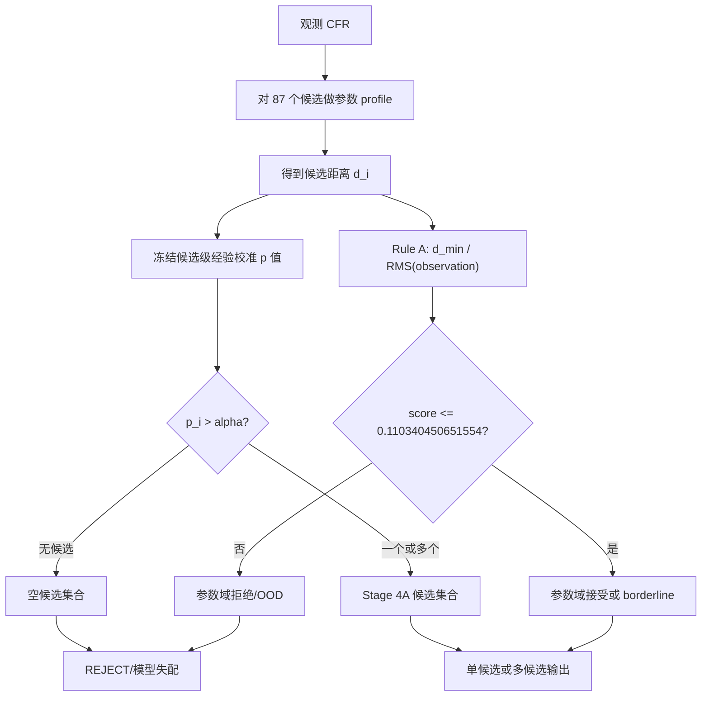

# Stage 5B.1 开工前项目静态审查

审查日期：2026-09-23

## 项目结构

本次工作的可信代码基线不是工作集根仓库，而是内嵌发布仓库 `matlab_plc_cfr_publish/`：

- 当前分支：`main`，跟踪 `origin/main`；
- 当前提交：`9611b284da57bd10cd64ee7e48c7ba9f3ec46a92`（`stage4a: archive clean-source freeze closure`）；
- canonical source commit：`54868370cc6c426f417681146caace79de782e91`；
- Stage 4A canonical formal 是在 `5486837` 的干净 detached worktree 上生成；
- 当前发布仓库的跟踪文件无修改，但有 511 个历史未跟踪结果文件；本阶段不得清理、覆盖或把这些文件当成新的 Stage 5B.1 结果；
- 外层工作集根仓库位于旧提交 `a232904`，且有大量既有修改和未跟踪资料，附件给出的两个冻结提交在外层仓库对象库中不存在。因此 Stage 5B.1 只在内嵌发布仓库中实施。

主要目录职责如下：

| 目录/文件 | 当前职责 |
|---|---|
| `README.md` | 全项目运行入口、模型边界和阶段索引 |
| `config/` | 各阶段冻结配置；Stage 4A.7.3 配置位于 `stage4a7_3_domain_validation_config.m` |
| `src/` | 正向模型、候选生成、profile 距离、校准候选集合、参数域判定与统计函数 |
| `experiments/` | 各阶段实验编排；Stage 4A.7.3 的正式实验主体位于同名文件 |
| `tests/` | 单元测试和完整回归入口 `run_tests.m` |
| `report/` | 阶段方法、结果、限制和 freeze gate 证据 |
| `results/data/stage4a_freeze_r1_1/` | Stage 4A canonical 数据、manifest、哈希与 formal/smoke 结果 |
| `run_stage4_freeze_r1_1.m` | Stage 4A 冻结复现总入口 |
| `run_stage4a7_3_domain_rejection_and_nonunique_validation.m` | 参数域/OOD 与 T3/T5 非唯一控制入口 |

## 当前研究流程

当前项目不是直接从 CFR 恢复任意未知图，而是在工程先验限定的候选空间内做候选确认：

```text
工程先验
  -> 工程候选枚举（约 204 个）
  -> 正向模型兼容性投影（冻结评分候选 87 个）
  -> 每候选参数 profile（每候选 243 个模板）
  -> profile distance 与候选非一致度分数
  -> 冻结经验校准候选集合
  -> Rule A 参数域 residual gate
  -> 单候选 / 多候选 / 空集合及 OOD 状态
```

观测链为：

```text
G, theta
  -> 传输线/ABCD/节点导纳正向 CFR
  -> 频域等效 OFDM CFR 观测与复高斯噪声
  -> profile distance
  -> 候选集合与参数域状态
```

项目已明确：OFDM 是离散测量 CFR 的手段，不会自动提高拓扑可辨识性；低 residual、候选集合单例和优化收敛均不能单独证明物理唯一性。

## 已完成能力

1. 正向模型：RLGC、传播常数、复特性阻抗、传输线 ABCD、支路阻抗回推、节点导纳与稳定级联。
2. 等效观测：OFDM 子载波、导频、LS CFR 估计及频域等效噪声接口；当前不是完整 IEEE 1901/G.hn 现场 PHY。
3. 候选生成：必选/禁用边、度约束、连通性、辐射性、规范图键及 Top-K 工程先验搜索。
4. 候选评分：`stage4a7_2_r1_profile_distance` 计算各候选 profile 最小距离；冻结候选确认器按独立 calibration 的经验分布产生候选集合。
5. 参数域拒绝：Rule A 使用 `profile_relative_distance`，冻结阈值为 `0.110340450651554`；Rule B 仅为敏感性分析，使用 `profile_min_distance`，阈值为 `0.0564853173821596`。
6. 独立验证：development、parameter calibration、Pilot 分离；formal 分别含 783、3480、783 个场景。
7. 非唯一控制：T3/T5 在匹配端接的指定 SISO 条件下构成数值等价正控制；无噪声、30 dB、10 dB 的 false-unique 分别为 `0/40`、`0/40`、`1/40`。
8. 可复现冻结：源码清单 411 项，canonical manifest、源码树哈希、配置哈希、运行环境和结果哈希均已归档。

## 当前限制

1. Stage 4A 的“候选阈值”并非单一距离阈值。拓扑候选先经候选级经验校准 p 值筛选，随后观测再经 Rule A 参数域 residual gate；Stage 5B.1 必须保留这两层语义。
2. 当前结果可以回答“哪些候选与观测相容”以及“观测是否超出冻结参数域”，但候选集合单例尚未附加 Top-1/Top-2 分离度和整体分数集中度证据。
3. Rule A 与 Rule B 没有统计意义上的科学唯一胜者；Rule A 只是预声明规则下的 canonical execution fallback。
4. near OOD 拒绝能力不足：lower/upper 仅拒绝 11/87 与 19/87；即使 far OOD 仍有误接受。
5. T3/T5 等价只在指定匹配端接和观测配置成立，不是所有参数、频带和端口下的全局等价结论。
6. 当前噪声为频域等效复高斯噪声，不是实机同步、耦合器、AGC、脉冲噪声和现场链路的联合验证。
7. formal summary MAT 保存了汇总、参数域模型和指标，但未保存每个 Pilot 样本的完整 87 维候选距离；Stage 5B.1 若要计算 margin、confidence 和 entropy，需用冻结输入与冻结随机种子确定性重算这些距离，不能从汇总 CSV 猜测。
8. 当前仓库存在大量历史未跟踪结果；新增输出必须进入独立 `results/data/stage5b1/`，并使用新文件名。

## Stage 4A 判据流程图



Rule A：先要求 development 域内接受率不低于 0.90，再在合格方法中最小化 medium/far OOD 误接受；并列时采用预声明稳定顺序。Rule B：严格词典序敏感性分析，先最大化域内接受率，再最小化 OOD 误接受。Pilot 不参与两条规则的选择。

## 当前代码入口

| 目的 | 入口/核心实现 |
|---|---|
| Stage 4A freeze | `run_stage4_freeze_r1_1.m` |
| OOD 与非唯一 formal | `run_stage4a7_3_domain_rejection_and_nonunique_validation.m` |
| Stage 4A.7.3 实验编排 | `experiments/exp_stage4a7_3_domain_rejection_and_nonunique_validation.m` |
| 冻结域配置 | `config/stage4a7_3_domain_validation_config.m` |
| 工程候选生成 | `src/generate_engineering_topology_candidates.m` |
| profile 距离 | `src/stage4a7_2_r1_profile_distance.m` |
| profile 候选集合 | `src/stage4a7_2_r1_apply_profile_candidate_set.m` |
| 参数域校准/应用 | `src/stage4a7_3_calibrate_domain_model.m`、`src/stage4a7_3_apply_domain_model.m` |
| T3/T5 控制 | Stage 4A.7.3 实验内 `nonunique_control` |
| 冻结测试 | `tests/test_stage4_freeze_r1_1.m`、`tests/test_stage4a7_3_domain_nonunique.m` |
| 完整回归 | `tests/run_tests.m` |

## 本阶段修改建议

1. 新增独立 Stage 5B.1 runner、实验、配置和结果目录，不修改 Stage 4A runner、Rule A/Rule B、冻结阈值、calibration/Pilot 数据或任何已有 CSV/MAT。
2. 把指标拆成可单测的小函数：
   - `compute_candidate_margin`：稳定排序并输出 `d1`、`d2`、绝对 margin；
   - `compute_candidate_confidence`：用数值稳定 softmax 计算 normalized confidence score 与 entropy，明确禁止称为 posterior probability；
   - `classify_stage5b1_decision_state`：只读取冻结 residual/candidate-set 结果及新增证据阈值，输出四状态。
3. Stage 5B.1 应确定性重放冻结 Pilot 与 T3/T5 场景，并用原 manifest 的 observation hash 做一致性校验；不重新训练或改写 Stage 4A 模型。
4. 新层的 `residual_accepted` 定义为：冻结候选集合非空且 Rule A 参数域 gate 接受。`REJECTED` 优先级最高；其余状态不得绕过 frozen gate。
5. `UNIQUE_CONFIDENT` 仅在 frozen candidate set 为单例、Top-1/Top-2 margin 足够、Top-1 normalized confidence 集中且 entropy 足够低时成立；证据不足的单例降为 `LOW_CONFIDENCE`。
6. frozen candidate set 多候选且 margin/置信度显示竞争者未分离时为 `MULTIPLE_AMBIGUOUS`；其他混合证据为 `LOW_CONFIDENCE`，避免把某个软指标单独当成唯一性证明。
7. 新阈值必须集中写入 Stage 5B.1 配置并记录定义、来源和版本。不得从 Pilot 标签或 T3/T5 测试结果反向调参；测试集只用于冻结后评价。
8. 输出至少包括 `candidate_margin.csv`、`candidate_confidence.csv`、`stage5b1_decision_metrics.csv`、`enhanced_decision_summary.csv`，并记录 baseline 与 enhanced 的 unique/ambiguous/rejected/false-unique 对比。
9. 新测试覆盖明显第一名、两个接近、全部差和 T3/T5 不得 false unique；随后运行 Stage 5B.1 smoke/formal 与完整回归。
10. 本阶段计算仍以串行为默认。热点在 profile-distance 重算；只有重复 formal 成为主要耗时且内存审计通过时才适合评估 `parfor`，本次不为并行重构。

## 审查结论

Stage 4A 冻结证据完整，且 canonical 源码、结果和限制可追溯。Stage 5B.1 可以启动，但必须作为只增不改的决策层：保留候选集合与 Rule A residual gate，在其上增加 margin、normalized confidence score、entropy 和四状态表达；目标是减少错误唯一判断，而不是追求更多唯一输出。
