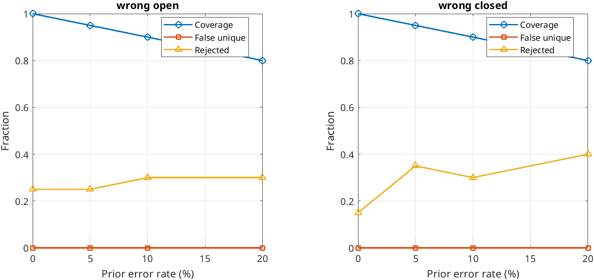
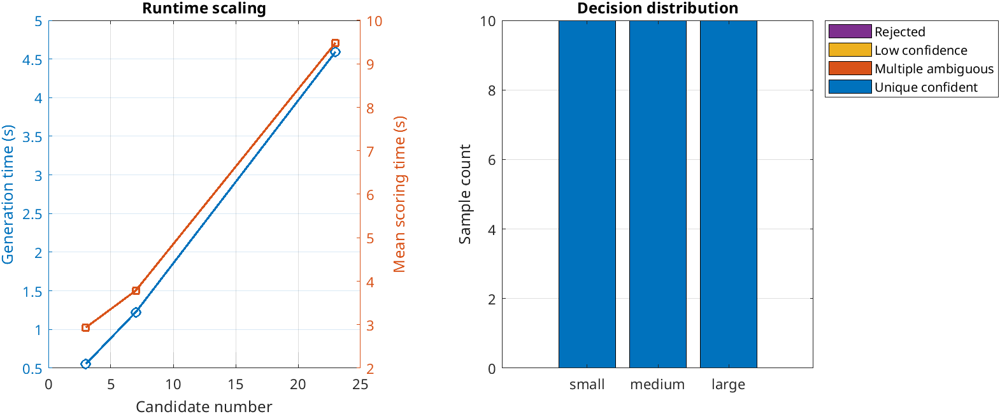
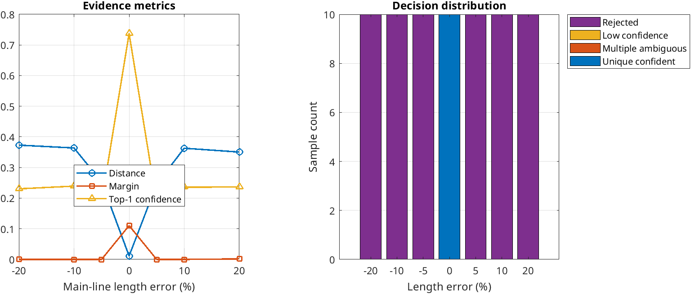
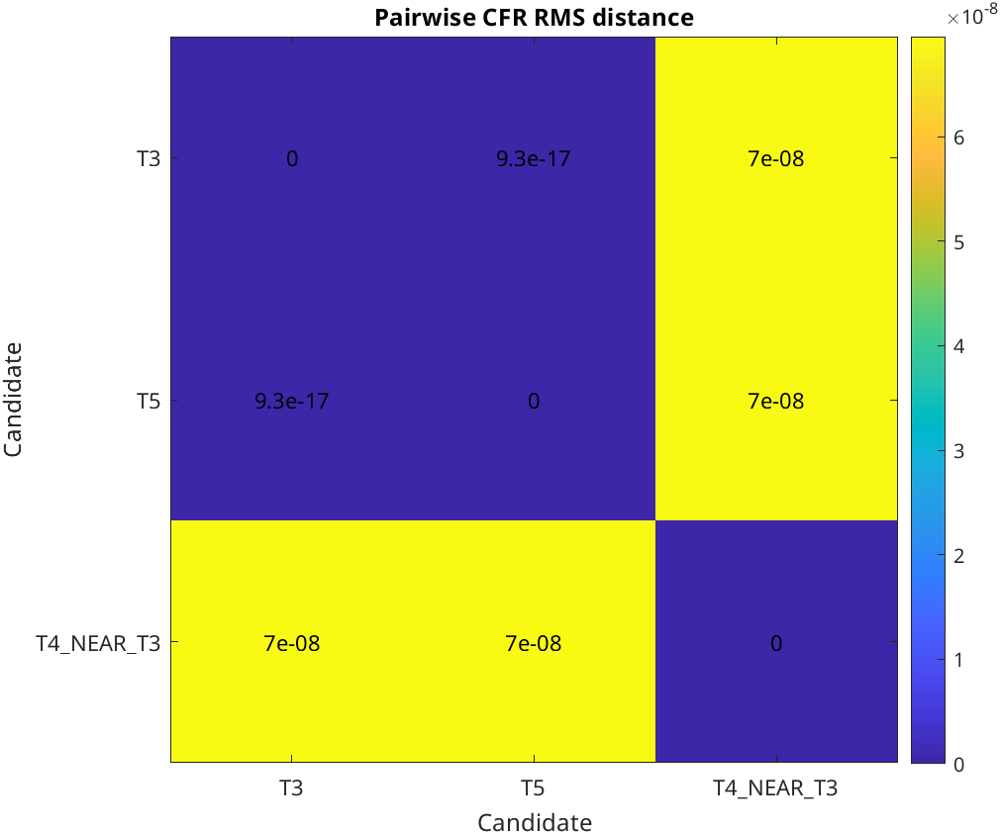

# Stage 6B Robustness and Identifiability Technical Review

实验日期：2026-09-23
代码基线：`50267e30da9f3d42789d12c6b3fdfead85ac0c86`（Stage 5B.1）及本阶段统一归档的 Stage 6A 实现
验证范围：controlled synthetic model-internal simulation

## 1. Motivation

Stage 6A 已回答“如何从 partial prior 生成候选”，但候选生成成功不等于识别可靠。错误开关信息可能删除真实拓扑，候选规模可能增加计算与竞争，线路参数失配可能使正确拓扑无法匹配，而不同拓扑在指定端口/参数下可能天然产生相同或极近的 CFR。

Stage 6B 的目标不是增加新识别算法，而是回答四个边界问题：

1. 错误 partial prior 是否导致错误 confident unique？
2. 候选空间扩大如何影响生成、评分与判决？
3. 线路长度和负载失配何时破坏当前匹配？
4. 两个或三个 CFR-close 拓扑能否被表达为不可辨识？

可靠性的正确含义不是“任何情况下都唯一输出”，而是证据充分时确认、模型或候选不匹配时拒绝、候选不可分时保留 ambiguity。

## 2. Relation to Stage 4A / 5B.1 / 6A

Stage 6B 没有修改已有方法：

- Stage 4A：继续使用既有 transmission-line/PLC CFR forward、profile distance 和 empirical candidate-set functions；frozen thresholds、canonical results 未覆盖。
- Stage 5B.1：继续使用既有 margin、normalized confidence score、normalized entropy 和四状态公式；formal results 未覆盖。
- Stage 6A：继续使用既有 partial-prior generation、constraint audit、ranking 和 forward export；generation logic 未修改。

除 identifiability 正控制读取已冻结的 Stage 5B.1 evidence model 外，前三项实验按候选库分别建立 Stage 6B calibration-only local model。它们不是 Stage 4A 87-candidate freeze threshold，也不能解释为跨候选库通用阈值。

本阶段归档以 Stage 5B.1 `50267e3` 为代码基线，并将 Stage 6A 与 Stage 6B 的增量统一纳入同一提交。

## 3. Experiment design

### 3.1 Partial-prior sensitivity

基准是 Stage 6A broad prior：M1--B1、M2--B2、M3--B3 均 unknown，共 7 个候选，受控 truth 是 M2 单支路。

- wrong open：错误把真实 M2--B2 设置为 open，生成 4 个候选，truth 不在库中；
- wrong closed：错误把实际不存在的 M1--B1 设置为 closed，生成 3 个候选，原 truth 不在库中；
- 标称 prior error rate：0%、5%、10%、20%；
- 每个 error type/rate 有 20 个 observation；分别精确施加 0、1、2、4 个错误 prior，因此 error rate 是样本总体中 prior 被扰动的比例，不是把 3 条开关记录近似取整；
- SNR：20 dB；truth 主线 scale 位于 calibration domain；
- false unique：`UNIQUE_CONFIDENT` 且最佳候选不是真拓扑。

### 3.2 Candidate-space scale

保持 4 段、80 m 主路径和受控 truth 不变，只扩大一层分支 grammar：

| scale | grammar | candidate count |
|---|---|---:|
| small | branch slots `[1,2]`，最多 1 支路 | 3 |
| medium | branch slots `[1,2,3]`，最多 2 支路 | 7 |
| large | 每个 slot 最多 2 支路，总数最多 4 | 23 |

每个规模使用相同的 10 个 20 dB observation。generation time 是预热后 20 次运行的中位数；scoring time 是 10 个 observation 的 profile/decision 总时间。

### 3.3 Parameter uncertainty

候选库固定为 medium 7 candidates，truth topology 不变：

- 主线长度 scale error：-20%、-10%、-5%、0、+5%、+10%、+20%；
- 每个长度误差 10 个样本；
- 每个样本独立施加 [-20%, +20%] 均匀负载 scale 扰动；
- SNR：30 dB；
- calibration main-length grid 仍为 `[0.98,1,1.02]`。

因此该实验测量的是“窄 ±2% calibration domain 对更大真实参数失配的拒绝行为”，而不是寻找现场通用容差。

### 3.4 Identifiability boundary

构造两个 positive controls：

1. T3/T5：匹配端接 50 Ω、SISO 条件下的镜像等价对；
2. 三拓扑 close case：T3、T5，以及 T4 的一个附加支路被设为长度 \(10^{-6}\) m、负载 \(10^{12}\) Ω，使该附加支路在当前模型中近电气不可见。

第二个案例是用于逼近可辨识性边界的退化数值构造，不代表典型现场线路。

## 4. Results

### 4.1 Prior sensitivity

来源：`results/data/stage6b/stage6b_prior_sensitivity.csv` 和 `stage6b_prior_sensitivity_summary.csv`。

| error type | rate | applied errors | coverage | corrupted false unique | corrupted rejected | overall decision distribution U/A/L/R |
|---|---:|---:|---:|---:|---:|---|
| wrong open | 0% | 0/20 | 1.00 | 0 | 0 | 15/0/0/5 |
| wrong open | 5% | 1/20 | 0.95 | 0 | 1 | 13/0/2/5 |
| wrong open | 10% | 2/20 | 0.90 | 0 | 2 | 14/0/0/6 |
| wrong open | 20% | 4/20 | 0.80 | 0 | 4 | 14/0/0/6 |
| wrong closed | 0% | 0/20 | 1.00 | 0 | 0 | 17/0/0/3 |
| wrong closed | 5% | 1/20 | 0.95 | 0 | 1 | 13/0/0/7 |
| wrong closed | 10% | 2/20 | 0.90 | 0 | 2 | 14/0/0/6 |
| wrong closed | 20% | 4/20 | 0.80 | 0 | 4 | 11/0/1/8 |

U/A/L/R 分别为 `UNIQUE_CONFIDENT / MULTIPLE_AMBIGUOUS / LOW_CONFIDENCE / REJECTED`。

总计 14 个真正施加错误 prior 的样本全部被拒绝，错误 confident unique 为 0。该结果回答了本受控案例中的 Q1：错误 prior 会降低 coverage，但 residual/domain gate 没有把库外 truth 强制映射为错误 confident unique。

不能由此证明任意错误 prior 均可安全拒绝；这里只测试了两个固定错误边、一个 truth 和 20 dB 噪声。

### 4.2 Candidate-space scale

来源：`stage6b_candidate_scale.csv` 和 `stage6b_candidate_scale_samples.csv`。

| scale | candidates | generation median (s) | total scoring (s) | mean scoring/sample (s) | U/A/L/R | false unique |
|---|---:|---:|---:|---:|---|---:|
| small | 3 | 0.0005525 | 0.002933 | 0.0002933 | 10/0/0/0 | 0 |
| medium | 7 | 0.0012240 | 0.003784 | 0.0003784 | 10/0/0/0 | 0 |
| large | 23 | 0.0045930 | 0.009484 | 0.0009484 | 10/0/0/0 | 0 |

从 3 到 23 candidates，generation median 增至约 8.31 倍，mean scoring time 增至约 3.23 倍。计算量按预期增长，但 30 个样本全部仍为正确 `UNIQUE_CONFIDENT`，没有出现 ambiguity 增加。

因此 Q2 的结论是：候选数增长提高计算成本，但“候选越多必然 ambiguity 越多”未被本实验支持。是否 ambiguous 取决于新增候选与 observation 的 CFR 可分性，而不只取决于数量。不同 candidate library 分别校准了 evidence temperature/threshold，因此 normalized confidence 或 entropy 不应脱离该校准跨库直接当成同一量尺比较。

### 4.3 Parameter uncertainty

来源：`stage6b_parameter_uncertainty.csv` 和 `stage6b_parameter_uncertainty_summary.csv`。

| main-length error | mean d1 | mean relative distance | mean margin | mean confidence | mean entropy | U/A/L/R |
|---:|---:|---:|---:|---:|---:|---|
| -20% | 0.373105 | 1.22462 | 0.0000356 | 0.23045 | 0.90598 | 0/0/0/10 |
| -10% | 0.363861 | 1.21449 | 0 | 0.23932 | 0.89532 | 0/0/0/10 |
| -5% | 0.253570 | 0.85670 | 0 | 0.18677 | 0.95725 | 0/0/0/10 |
| 0% | 0.011414 | 0.03960 | 0.110367 | 0.73761 | 0.52610 | 10/0/0/0 |
| +5% | 0.245501 | 0.85417 | 0 | 0.18540 | 0.95909 | 0/0/0/10 |
| +10% | 0.363024 | 1.29217 | 0 | 0.23597 | 0.90282 | 0/0/0/10 |
| +20% | 0.350480 | 1.29250 | 0.001733 | 0.23620 | 0.90162 | 0/0/0/10 |

0% length error 下，即使包含随机 ±20% load perturbation，10/10 为 `UNIQUE_CONFIDENT`。一旦长度误差达到 ±5% 或以上，当前窄 calibration domain 下 60/60 全部 `REJECTED`，没有 false unique。

Q3 的受控结论是：当前 complex CFR/profile 对主线长度失配高度敏感；系统选择拒绝而不是错误确认。该结果不能解释为“PLC 系统普遍只能容忍小于 5% 的长度误差”，因为频带、参数网格、负载模型、端口和 noise 均固定。

### 4.4 Identifiability boundary

来源：`stage6b_identifiability.csv` 和 `stage6b_identifiability_distance_matrix.csv`。

| scenario | candidates | candidate gap | Top-1/2 margin | normalized entropy | Top-1 confidence | state |
|---|---:|---:|---:|---:|---:|---|
| T3/T5 | 2 | \(9.34\times10^{-17}\) | \(9.34\times10^{-17}\) | 1.000000 | 0.500000 | `MULTIPLE_AMBIGUOUS` |
| three topology close | 3 | \(6.96\times10^{-8}\) | \(9.34\times10^{-17}\) | 0.9999999993 | 0.333343 | `MULTIPLE_AMBIGUOUS` |

T3/T5 pairwise CFR RMS distance为 \(9.34\times10^{-17}\)。第三个退化拓扑与 T3/T5 的距离约为 \(6.96\times10^{-8}\)。两种情况都具有接近最大归一化熵，且 Top-1/2 margin 近零，现有决策层均输出 `MULTIPLE_AMBIGUOUS`。

这回答了 Q4：当观测配置使多个 topology CFR 相同或远小于当前 evidence threshold 时，CFR 信息本身不足，正确输出是 ambiguity，不应消除或强制唯一。

### 4.5 Runtime

正式串行运行、单 worker 总时间为 11.068872 s：prior sensitivity 7.298749 s、candidate scale 1.985560 s、parameter uncertainty 0.983966 s、identifiability 0.800532 s。该 wall-clock 仅用于本机受控实验记录，不是跨硬件 benchmark。

## 5. Main findings

### 什么情况下可靠？

- truth 在候选库中、主线参数处于窄 calibration domain、20--30 dB 噪声且候选 CFR 可分时，本实验保持 confident unique；candidate-scale 的 30/30 与 parameter 0% 的 10/10 均如此。
- 可靠性结论始终受候选库、频带、端口、参数网格和正向模型约束，不表示物理全局唯一。

### 什么情况下拒绝？

- wrong-open 或 wrong-closed 把 truth 排除出候选库时，本实验 14/14 实际受扰样本拒绝；
- 主线长度超出 ±2% calibration domain 达到 ±5% 或更大时，本实验 60/60 拒绝；
- 拒绝说明“当前候选/参数模型不足”，不是自动定位 prior 中哪条记录错误。

### 什么情况下不可辨识？

- 匹配端接 SISO 下 T3/T5 镜像等价；
- 额外支路电气效应趋近不可见时，三拓扑也可形成近等价候选；
- 此时 margin 近零、normalized entropy 接近 1，输出 `MULTIPLE_AMBIGUOUS`。

## 6. Limitations

1. 所有实验均为受控 MATLAB 模型仿真，不是现场、硬件或跨台区验证。
2. prior error rate 是 20 个样本总体中的错误比例，只测试一个 wrong-open edge 和一个 wrong-closed edge。
3. candidate scale 最大仅 23，且仍是固定 4 段主路径的一层支路 grammar，未覆盖一般大规模树。
4. generation/runtime 数字很小，易受 MATLAB/JIT/硬件影响；只报告预热重复中位数和本机 wall-clock。
5. 参数实验把长度误差施加为全主线统一 scale，没有测试各线段独立误差、RLGC 误差、复负载频变或同步误差。
6. calibration domain 仅 ±2%，因此 ±5% 全拒绝说明当前 protocol 较窄，不是普适物理容差。
7. 三拓扑 close case 使用 \(10^{-6}\) m、\(10^{12}\) Ω 的退化附加支路，只是可辨识性边界构造。
8. current forward adapter 仍只支持 TX--RX 单主路径加内部节点一层叶支路。
9. 每个 candidate library 的 local evidence model 重新校准；跨库 confidence/entropy 不应直接解释为同一概率尺度，normalized score 仍不是 Bayesian posterior。

## 7. Next step

本阶段结果已足以支撑一节“受控 robustness and identifiability evaluation”，下一步建议优先进行 report/thesis writing，并明确区分 implemented、simulation-verified 和 not field-verified。

若继续技术扩展，优先选择 multi-view CFR：改变发送/接收端口或加入双向/多节点观测，验证 T3/T5 和 near-invisible branch ambiguity 是否被额外视角打破。扩展前应冻结 Stage 6B 的 CSV、配置和图表，不应直接修改当前四状态公式。

## Result-source mapping

| 结论 | 源文件 |
|---|---|
| prior coverage / false unique / state | `stage6b_prior_sensitivity.csv`、`stage6b_prior_sensitivity_summary.csv` |
| candidate count / generation / scoring / state | `stage6b_candidate_scale.csv`、`stage6b_candidate_scale_samples.csv` |
| length/load uncertainty metrics | `stage6b_parameter_uncertainty.csv`、`stage6b_parameter_uncertainty_summary.csv` |
| two/three topology identifiability | `stage6b_identifiability.csv`、`stage6b_identifiability_distance_matrix.csv` |
| experiment wall-clock | `stage6b_runtime.csv` |
